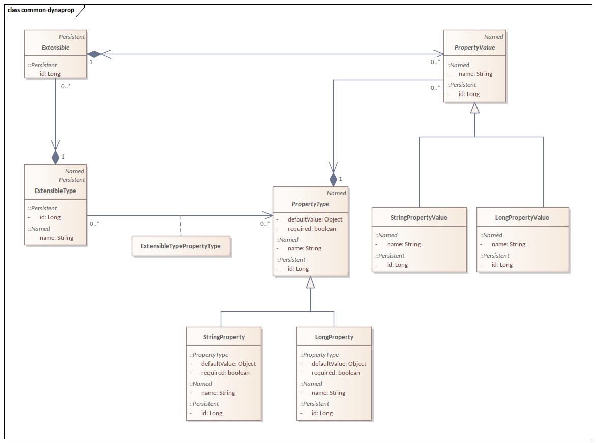

# Common-Extensible (Dynamic Properties with spring-data-jpa)

I found it a fairly common requirement in my past project to provide a framework, by which existing entities in a relational database 
can be extended by custom properties (via a GUI).
Then, these properties can be used in requests (GraphQL) or even business logic.
However, every one of the implementations I came across were inefficient in some way, mostly:
a) hitting the database and getting all the properties from the database and compiling the results in memory -> high memory consumption 
and high I/O due to reading unneccesary properties from the database.
b) providing hand-written custom SQL queries or even using String concatenation to build SQL statements from metadata or by reflection.
So, I was wondering if a framework can be developed which solves the above problem using plain ```spring-data-jpa``` with most relational databases
on the market today.

# Features

It should be possible to create/modify ```ExtensibleTypes``` (collection of ```PropertyTypes```) during runtime, 
which then can be attached to ```Extensible``` objects.

It should be possible to get a set of ```PropertyValues``` of a specific ```Extensible``` efficiently.

It should be possible to provide metadata of an ```ExtensibleType``` (eg.: json schema).




## Remarks:
- as you can see on the domain model, the current implementation has a many-to-many relation between ```ExtensibleType``` and 
```PropertyType```, which is unidirectional from the ```ExtensibleType``` side. This is required not to a have a circular reference in the parametrized classes

- This many-to-many relationship might have an effect on performance 
(even though it is modeled in JPA as two manyToOne-s), but allows for reusable properties between ```ExtensibleTypes```
giving the possibility of having __global__ ```PropertyType``` objects. (shared between all object types)
- If this feature is not required, it might be better to use a unidirectional ManyToOne on the ```PropertyType``` side.


# Acceptance Criteria

Performance is the key requirement for all operations.

# Limitations
The framework does not provide a DB structure, you have to map your structure to the interfaces provided by the framework.
see the tests.
